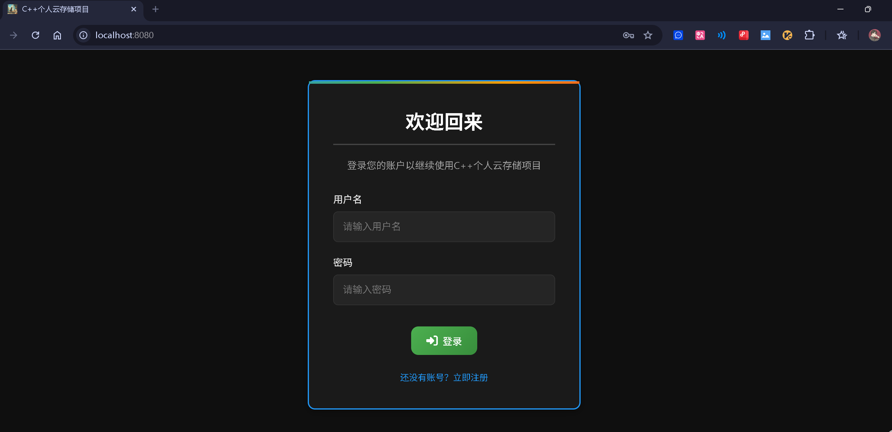
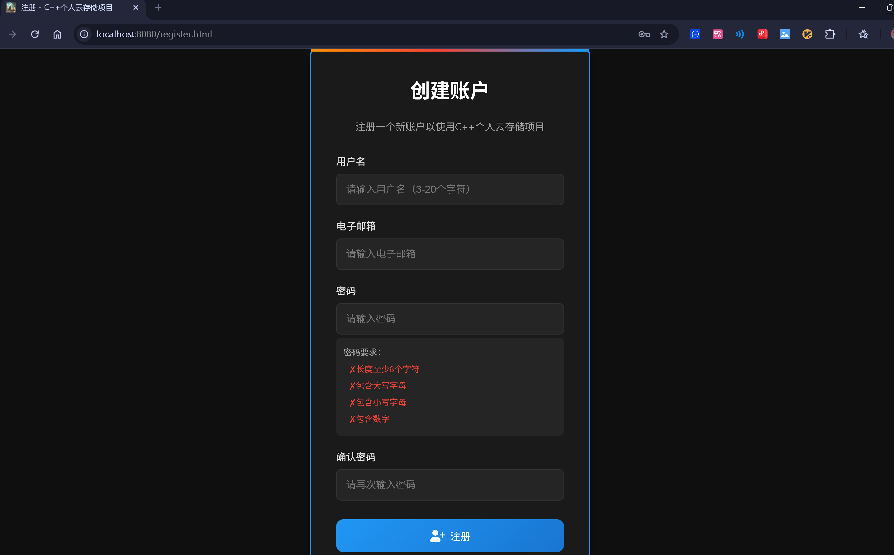
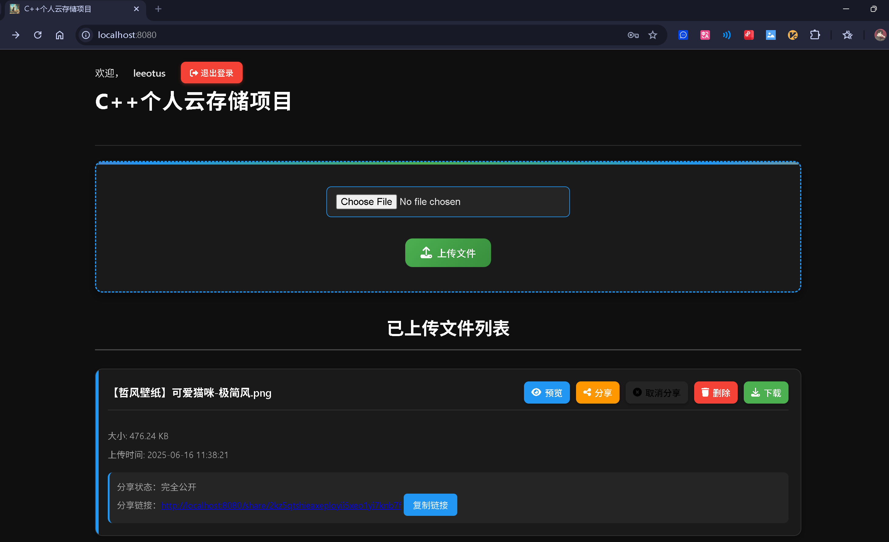
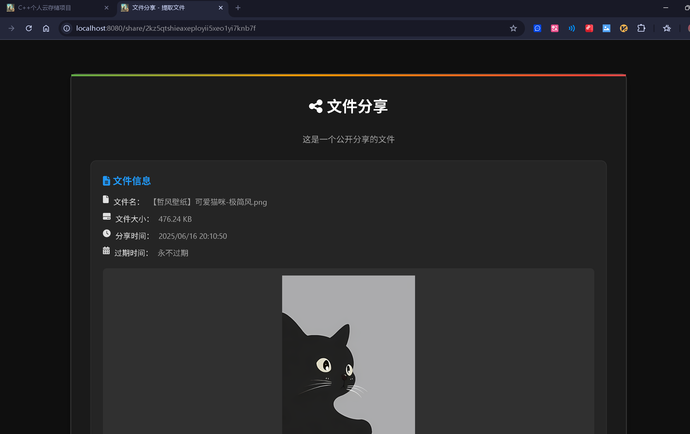

# C++个人云存储项目

本项目是基于C++语言开发的个人云存储系统，主要依据[muduo](https://github.com/chenshuo/muduo)网络库进行编写，并在此基础上进行了多项优化。支持用户上传、下载文件，具备完善的权限校验机制，确保数据的安全性和用户信息的隐私性。同时，对大文件的上传和文件断点功能进行了优化，提升了用户在处理大文件时的体验

##  主要特点
- 支持注册登录
- 支持文件管理
- 支持视频预览
- 支持图片预览
- 支持文件分享
- 优化了大文件上传
- 支持断点下载

## 数据库

数据库当前采用MySQL(version 8.0)，用于实现用户注册/登录、文件管理、分享文件管理等表的设计:
- users 用户表
- sessions 保存用户会话用于HTTP API校验
- files 保存个人文件
- file_shares 保存文件分享记录

> 保存在file_keeper.sql中

```sql
-- 删除数据库
DROP DATABASE file_manager;
-- 创建数据库
CREATE DATABASE IF NOT EXISTS file_manager DEFAULT CHARACTER SET utf8mb4 COLLATE utf8mb4_unicode_ci;

USE file_manager;

-- 创建用户表
CREATE TABLE IF NOT EXISTS users (
    id INT PRIMARY KEY AUTO_INCREMENT,
    username VARCHAR(50) NOT NULL UNIQUE,
    password VARCHAR(64) NOT NULL,
    email VARCHAR(100),
    created_at TIMESTAMP DEFAULT CURRENT_TIMESTAMP,
    updated_at TIMESTAMP DEFAULT CURRENT_TIMESTAMP ON UPDATE CURRENT_TIMESTAMP,
    INDEX idx_username (username)
) ENGINE=InnoDB DEFAULT CHARSET=utf8mb4 COLLATE=utf8mb4_unicode_ci;

-- 创建会话表
CREATE TABLE IF NOT EXISTS sessions (
    id INT PRIMARY KEY AUTO_INCREMENT,
    session_id VARCHAR(32) NOT NULL UNIQUE,
    user_id INT NOT NULL,
    username VARCHAR(50) NOT NULL,
    expire_time TIMESTAMP NOT NULL,
    created_at TIMESTAMP DEFAULT CURRENT_TIMESTAMP,
    INDEX idx_session_id (session_id),
    INDEX idx_user_id (user_id),
    INDEX idx_expire_time (expire_time),
    FOREIGN KEY (user_id) REFERENCES users(id) ON DELETE CASCADE
) ENGINE=InnoDB DEFAULT CHARSET=utf8mb4 COLLATE=utf8mb4_unicode_ci;

-- 创建文件表
CREATE TABLE IF NOT EXISTS files (
    id INT PRIMARY KEY AUTO_INCREMENT,
    filename VARCHAR(255) NOT NULL,
    original_filename VARCHAR(255) NOT NULL,
    file_size BIGINT UNSIGNED NOT NULL,
    file_type VARCHAR(50),
    user_id INT NOT NULL,
    created_at TIMESTAMP DEFAULT CURRENT_TIMESTAMP,
    updated_at TIMESTAMP DEFAULT CURRENT_TIMESTAMP ON UPDATE CURRENT_TIMESTAMP,
    INDEX idx_filename (filename),
    INDEX idx_user_id (user_id),
    FOREIGN KEY (user_id) REFERENCES users(id) ON DELETE CASCADE
) ENGINE=InnoDB DEFAULT CHARSET=utf8mb4 COLLATE=utf8mb4_unicode_ci;

-- 创建文件分享表
CREATE TABLE IF NOT EXISTS file_shares (
    id INT PRIMARY KEY AUTO_INCREMENT,
    file_id INT NOT NULL,
    owner_id INT NOT NULL,
    shared_with_id INT,
    share_type ENUM('private', 'public', 'protected', 'user') NOT NULL,
    share_code VARCHAR(32) NOT NULL,
    expire_time TIMESTAMP NULL,
    created_at TIMESTAMP DEFAULT CURRENT_TIMESTAMP,
    extract_code VARCHAR(6),
    INDEX idx_file_id (file_id),
    INDEX idx_owner_id (owner_id),
    INDEX idx_shared_with_id (shared_with_id),
    INDEX idx_share_code (share_code),
    INDEX idx_expire_time (expire_time),
    FOREIGN KEY (file_id) REFERENCES files(id) ON DELETE CASCADE,
    FOREIGN KEY (owner_id) REFERENCES users(id) ON DELETE CASCADE,
    FOREIGN KEY (shared_with_id) REFERENCES users(id) ON DELETE CASCADE
) ENGINE=InnoDB DEFAULT CHARSET=utf8mb4 COLLATE=utf8mb4_unicode_ci;


```

## 编译和运行

项目使用cmake进行编译：

```bash
git clone https://github.com/leeotus/cloud-storage.git
cd ./cloud-storage

cmake -S . -B build -DCMAKE_BUILD_TYPE=Debug
cmake --build build --config Debug
```

> 本项目还是用到boost库和nlohmann::json库，编译过程中若遇到问题可能是这些库没有安装

在编译完成之后，会在`build`目录下生成可执行文件，执行一下命令启动项目：

```bash
./build/app/filekeeper
```

## 项目展示






